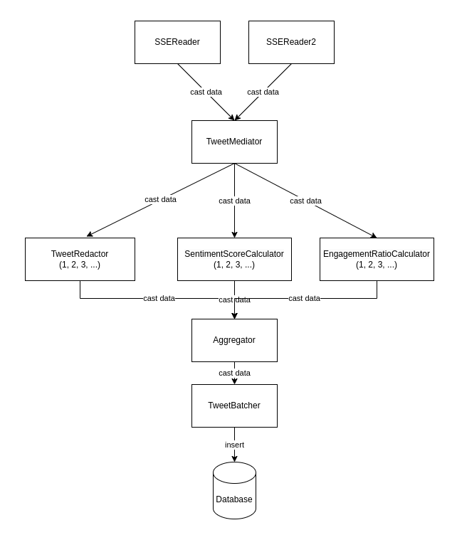
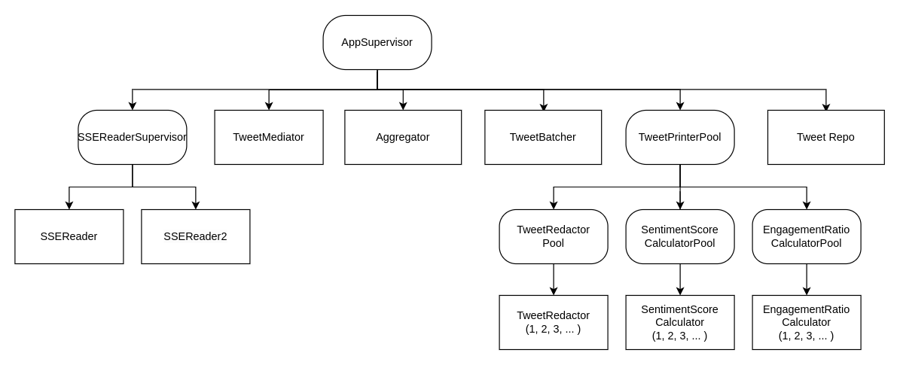

# FAF.PTR16.1 -- Project 1

> **Performed by:** Cernei Andrei, group FAF-201
> **Verified by:** asist. univ. Alexandru Osadcenco

All weeks for this project aim to build upon the same application. Because of that below will be presented each module of the project in its final form. 

## Message Flow Diagram



<br>

## Supervision Tree Diagram



### SSEReader

``` elixir
defmodule SSEReader do
  use GenServer
  require EventsourceEx
  require Logger
  ...
  def handle_info(data, state) do
    GenServer.cast(Process.whereis(:TweetMediator), {:tweet, data})
    {:noreply, state}
  end
end
```

handle_info function is called whenever the SSEReader process receives a new message. In this case, it expects the message to be an SSE event, which is passed as data. The function then sends a message to TweetMediator process, using the GenServer.cast function. The message is a tuple of {:tweet, data}, which indicates that a new tweet has been received. Finally, the function returns {:noreply, state}, indicating that the SSEReader process should continue running.

### Tweet Mediator
``` elixir
defmodule TweetMediator do
  use GenServer
  ...
  # Least Connected
  defp choose_worker_pid() do
    {:ok, redactor_pool_size} = TweetPrinterPool.get_num_workers(:redactor)
    {:ok, sentiment_pool_size} = TweetPrinterPool.get_num_workers(:sentiment)
    {:ok, engagement_pool_size} = TweetPrinterPool.get_num_workers(:engagement)

    redactor_task_counts =
      for i <- 1..redactor_pool_size do
        redactor_worker_pid = ProcessHelper.get_worker_pid(TweetRedactor, i)

        case redactor_worker_pid do
          nil ->
            {:skip, i}

          pid ->
            info = Process.info(pid, [:message_queue_len])
            {pid, info[:message_queue_len]}
        end
      end

    sentiment_task_counts =
      for i <- 1..sentiment_pool_size do
        sentiment_worker_pid = ProcessHelper.get_worker_pid(SentimentScoreCalculator, i)

        case sentiment_worker_pid do
          nil ->
            {:skip, i}

          pid ->
            info = Process.info(pid, [:message_queue_len])
            {pid, info[:message_queue_len]}
        end
      end
  end
end
```

This code is choosing the least connected worker processes for each of the three tasks TweetRedactor, SentimentScoreCalculator and EngagementRatioCalculator by finding the process with the shortest message queue length. It then returns a tuple of the chosen process IDs for each of the tasks.

The code first retrieves the number of worker processes for each task using TweetPrinterPool.get_num_workers. It then uses a for loop to iterate over each worker process for each task and retrieves its process ID using ProcessHelper.get_worker_pid/2. If the process ID is nil, the loop skips over it. If the process ID is valid, it retrieves the message queue length using Process.info. It then returns a tuple of the process ID and its message queue length.

Once it has collected the message queue lengths for each worker process, it sorts the list by the message queue length and selects the process with the shortest queue length using hd function. It then returns a tuple of the chosen process IDs for each task.

This code is used to distribute work across worker processes and balance the workload across the available resources.

<br><br>

### Tweet Printer Pool

```elixir
defmodule TweetPrinterPool do
  use Supervisor
  ...
  def init([worker_type, lambda, min_workers]) do
    worker_name = Module.split(worker_type) |> List.last()
    IO.puts("Starting #{worker_name}Pool")
    Process.register(self(), String.to_atom("#{worker_type}Pool"))

    children =
      for i <- 1..min_workers do
        worker = {worker_type, [i, lambda]}
        Supervisor.child_spec(worker, id: i, restart: :permanent)
      end

    Supervisor.init(children, strategy: :one_for_one)
  end
end
```

The init function registers the supervisor process with a name based on the worker_type, and then generates a list of child specifications for the worker processes. It uses a for loop to create min_workers number of workers, each with an ID and the lambda parameter. It then initializes the supervisor with the child specifications, using the Supervisor.init function.

Overall, this code provides a way to spawn and manage a pool of worker processes for a given task.

### Tweet Redactor

```elixir
defmodule TweetRedactor do
  use GenServer

  @bad_words File.read!("lib/bad-words.txt") |> String.split("\r\n")
  ...
  def handle_cast({:tweet, %EventsourceEx.Message{data: data}}, lambda) do
    case Jason.decode(data) do
      {:ok, json_data} ->
        tweet_id = json_data["message"]["tweet"]["id"]
        tweet_text = json_data["message"]["tweet"]["text"]
        user_id = json_data["message"]["tweet"]["user"]["id"]
        user_name = json_data["message"]["tweet"]["user"]["name"]
        redacted_text = redact(tweet_text)

        GenServer.cast(
          Process.whereis(:Aggregator),
          {:redacted_text,
           %{:text => redacted_text, :user_id => user_id, :user_name => user_name}, :id, tweet_id}
        )

        sleep_time = Statistics.Distributions.Poisson.rand(lambda) |> round()
        :timer.sleep(sleep_time)
        {:noreply, lambda}

      _ ->
        IO.puts("Error extracting tweet text from JSON data: #{data}")
        IO.puts("#{ProcessHelper.get_name(self())} DIED")
        Process.exit(self(), :kill)
        {:noreply, lambda}
    end
  end

  defp redact(text) do
    String.split(text, " ")
    |> Enum.map(fn word ->
      original_word = word

      if Enum.member?(@bad_words, String.downcase(word)) do
        String.duplicate("*", String.length(word))
      else
        original_word
      end
    end)
    |> Enum.join(" ")
  end
end
```
This module implements a handle_cast function that receives a message from a process and extracts a tweet from it. The tweet text is then redacted by replacing any bad words in the text with asterisks. The redacted text is then sent to the Aggregator process with the tweet ID, user ID, and user name. The function also generates a random sleep time using a Poisson distribution to simulate some processing time. If there is an error decoding the message or extracting the tweet text, the function prints an error message and kills the process.

The redact function splits the tweet text into words, maps over the words, and checks if each word is in a list of bad words. If the word is a bad word, it is replaced by asterisks. The redacted words are then joined together to form the redacted text.


### Sentiment Score Calculator

```elixir
defmodule SentimentScoreCalculator do
  use GenServer
  require HTTPoison
  ...
  def handle_cast({:tweet, %EventsourceEx.Message{data: data}}, lambda) do
    case Jason.decode(data) do
      {:ok, json_data} ->
        tweet_id = json_data["message"]["tweet"]["id"]
        tweet_text = json_data["message"]["tweet"]["text"]
        emotional_scores = get_sentiment_map()
        sentiment_score = calculate_sentiment(tweet_text, emotional_scores)

        GenServer.cast(
          Process.whereis(:Aggregator),
          {:sentiment_score, sentiment_score, :id, tweet_id}
        )

        sleep_time = Statistics.Distributions.Poisson.rand(lambda) |> round()
        :timer.sleep(sleep_time)
        {:noreply, lambda}

      _ ->
        IO.puts("Error extracting tweet text from JSON data: #{data}")
        IO.puts("#{ProcessHelper.get_name(self())} DIED")
        Process.exit(self(), :kill)
        {:noreply, lambda}
    end
  end

  defp get_sentiment_map() do
    {:ok, response} = HTTPoison.get("http://localhost:4000/emotion_values")
    response_body = response.body
    lines = String.split(response_body, "\r\n")

    emotional_scores =
      lines
      |> Enum.map(&String.split(&1, "\t"))
      |> Enum.reduce(%{}, fn [word, score], acc ->
        Map.merge(acc, %{word => String.to_integer(score)})
      end)

    emotional_scores
  end

  defp calculate_sentiment(text, emotional_scores) do
    words = String.split(text, " ")
    scores = words |> Enum.map(&Map.get(emotional_scores, String.downcase(&1), 0))

    sentiment_score =
      if Enum.count(scores) > 0, do: Enum.sum(scores) / Enum.count(scores), else: 0

    sentiment_score
  end
end
```
This is a module implementing the behavior of a GenServer process that handles incoming tweet messages. The handle_cast function receives a message with a JSON payload representing a tweet, extracts the tweet's ID and text from the payload, calculates its sentiment score using the calculate_sentiment function, and sends a sentiment_score message with the score and tweet ID to the Aggregator process. Then it sleeps for a random amount of time, drawn from a Poisson distribution with mean lambda.

The get_sentiment_map function sends a GET request to an external service running on http://localhost:4000/emotion_values and retrieves a list of words and their corresponding emotional scores. It then transforms the list into a map with the words as keys and the scores as values.

The calculate_sentiment function takes a string of text and an emotional scores map, splits the text into words, looks up the emotional score for each word in the map, and calculates the sentiment score as the average of the scores for all words in the text.

### Engagement Ratio Calculator

```elixir
defmodule EngagementRatioCalculator do
  use GenServer
  ...
  def handle_cast({:tweet, %EventsourceEx.Message{data: data}}, lambda) do
    case Jason.decode(data) do
      {:ok, json_data} ->
        tweet_id = json_data["message"]["tweet"]["id"]
        favorite_count = json_data["message"]["tweet"]["favorite_count"]
        retweet_count = json_data["message"]["tweet"]["retweet_count"]
        followers_count = json_data["message"]["tweet"]["user"]["followers_count"]

        engagement_ratio =
          compute_ratio(
            favorite_count,
            retweet_count,
            followers_count
          )

        GenServer.cast(
          Process.whereis(:Aggregator),
          {:engagement_ratio, engagement_ratio, :id, tweet_id}
        )

        sleep_time = Statistics.Distributions.Poisson.rand(lambda) |> round()
        :timer.sleep(sleep_time)
        {:noreply, lambda}

      _ ->
        IO.puts("Error extracting tweet text from JSON data: #{data}")
        IO.puts("#{ProcessHelper.get_name(self())} DIED")
        Process.exit(self(), :kill)
        {:noreply, lambda}
    end
  end

  defp compute_ratio(likes, retweets, followers) do
    engagement_ratio = if followers > 0, do: (likes + retweets) / followers,
    else: 0
    engagement_ratio
  end
end
```

The handle_cast function processes incoming :tweet messages and computes the engagement ratio for each tweet. It then sends a :engagement_ratio message with the computed ratio to the Aggregator process, along with the tweet ID. The function also sleeps for a random amount of time determined by a Poisson distribution with a parameter lambda.

The compute_ratio function takes the number of likes, retweets, and followers for a tweet and computes the engagement ratio as the sum of likes and retweets divided by the number of followers. If the number of followers is 0, the function returns 0 as the engagement ratio.

This function is responsible for computing and sending the engagement ratio for each incoming tweet to the Aggregator process.

### Aggregator

```elixir
defmodule Aggregator do
  use GenServer
  ...
  defp find_matching_set(state) do
    redacted_tweets = state.redacted_tweets
    sentiment_scores = state.sentiment_scores
    engagement_ratios = state.engagement_ratios

    maps = [redacted_tweets, sentiment_scores, engagement_ratios]

    common_keys =
      Enum.reduce(maps, MapSet.new(Map.keys(redacted_tweets)), fn map, acc ->
        MapSet.intersection(acc, MapSet.new(Map.keys(map)))
      end)

    if MapSet.size(common_keys) > 0 do
      Enum.reduce(common_keys, [], fn key, matching_sets ->
        case {Map.fetch(redacted_tweets, key), Map.fetch(sentiment_scores, key),
              Map.fetch(engagement_ratios, key)} do
          {{:ok, [redacted_tweet]}, {:ok, [sentiment_score]}, {:ok, [engagement_ratio]}} ->
            matching_set = [key, redacted_tweet, sentiment_score, engagement_ratio]
            [matching_set | matching_sets]

          _ ->
            matching_sets
        end
      end)
    else
      nil
    end
  end
end
```

The main part of the agregator is finding matching set. This function takes a state parameter that contains three maps: redacted_tweets, sentiment_scores, and engagement_ratios. It finds all the keys that are common to all three maps using Enum.reduce and MapSet.intersection functions.

If there are any common keys, it creates a list of matching sets where each set contains the key, the corresponding value from the redacted_tweets map, the corresponding value from the sentiment_scores map, and the corresponding value from the engagement_ratios map.

If there are no common keys, it returns nil.

It uses the Map.fetch function to retrieve the values from the maps for a given key. If any of the values cannot be retrieved (i.e., the key is not present in one of the maps), it skips that key and moves on to the next one. If all three values can be retrieved, it creates a matching set and adds it to the list of matching sets.

### Tweet Batcher 

```elixir
defmodule TweetBatcher do
  use GenServer
  ...
  def handle_cast({:batch, matching_set}, state) do
    new_matching_sets =
      if Enum.member?(state.matching_sets, matching_set) do
        state.matching_sets
      else
        [matching_set | state.matching_sets]
      end

    if length(new_matching_sets) == state.batch_size do
      Process.cancel_timer(state.time_ref)
      IO.puts("\nBatch of #{state.batch_size} tweets:")

      new_matching_sets
      |> Enum.map(fn matching_set ->
        user_id = matching_set |> Enum.at(1) |> Map.get(:user_id)
        user_name = matching_set |> Enum.at(1) |> Map.get(:user_name)
        tweet = matching_set |> Enum.at(1) |> Map.get(:text)
        tweet_id = matching_set |> Enum.at(0)
        sentiment = matching_set |> Enum.at(2)
        engagement = matching_set |> Enum.at(3)

        user_changeset = User.changeset(%User{}, %{id: user_id,
        user_name: user_name})

        tweet_changeset =
          Tweet.changeset(%Tweet{}, %{
            id: tweet_id,
            message: tweet,
            sentiment: sentiment,
            engagement: engagement,
            user_id: user_id
          })

        Tweets.Repo.insert(user_changeset, on_conflict: :nothing)
        Tweets.Repo.insert(tweet_changeset, on_conflict: :nothing)
      end)

      new_time_ref = print_after(state.time_window)
      {:noreply, %{state | matching_sets: [], time_ref: new_time_ref}}
    else
      {:noreply, %{state | matching_sets: new_matching_sets}}
    end
  end
end

```

The first thing that this function does is to check if the matching set is already present in the current state of the process or not. If it is present, then it returns the current state without any modification, otherwise, it adds the new matching set to the existing list of matching sets in the state.

Next, it checks if the length of the updated matching sets list is equal to the batch size or not. If the length is equal to the batch size, then it proceeds to insert the tweets into the database.

The tweets are inserted into the database using Ecto.Changeset in the Enum.map block. The tweet information is extracted from each matching set and the corresponding User and Tweet changesets are created. These changesets are then inserted into the database using Tweets.Repo.insert.

If the length of the updated matching sets list is less than the batch size, then it just returns the updated state with the new matching sets list.

Finally, it sets a new time reference for the next batch of tweets to be processed and returns the updated state with an empty list of matching sets and the new time reference.

## Schemas
### Tweet schema

```elixir
defmodule Tweet do
  use Ecto.Schema
  import Ecto.Changeset

  @primary_key {:id, :integer, []}
  schema "tweets" do
    field(:message, :string)
    field(:sentiment, :float)
    field(:engagement, :float)
    belongs_to(:user, User, foreign_key: :user_id)
  end

  def changeset(user, params) do
    user
    |> cast(params, [:id, :message, :sentiment, :engagement, :user_id])
  end
end
```
This is an Ecto schema definition for the Tweet model.

The schema has four fields:
- message: a string field representing the text content of the tweet.
- sentiment: a float field representing the sentiment score of the tweet.
- engagement: a float field representing the engagement score of the tweet.
- user: a belongs_to association with the User model, representing the user who authored the tweet.

### User schema
```elixir
defmodule User do
  use Ecto.Schema
  import Ecto.Changeset

  @primary_key {:id, :integer, []}
  schema "users" do
    field(:user_name, :string)
  end

  def changeset(user, params) do
    user
    |> cast(params, [:id, :user_name])
    |> unique_constraint(:id, message: "USER_EXISTS_WITH_SAME_ID")
  end
end
```
The User schema defines a single field user_name of type string and a primary key id of type integer. The changeset function takes in a user struct and params map and applies those params as changes to the struct, casting them to the correct types. It then ensures that the id field is unique and adds a custom error message if a duplicate record exists with the same id.

## Migrations
### CreateUsers migration
```elixir
defmodule Tweets.Repo.Migrations.CreateUsers do
  use Ecto.Migration

  def change do
    create table(:users, primary_key: false) do
      add(:id, :bigint, primary_key: true)
      add(:user_name, :string)
    end
  end
end
```
This Ecto migration creates a table called users with two columns: id and user_name. The id column is a bigint that is also set as the primary key of the table. The user_name column is a string that will store the name of the user.

### CreateTweets migration
```elixir
defmodule Tweets.Repo.Migrations.CreateTweets do
  use Ecto.Migration

  def change do
    create table(:tweets, primary_key: false) do
      add(:id, :bigint, primary_key: true)
      add(:message, :string)
      add(:sentiment, :float)
      add(:engagement, :float)
      add(:user_id, references(:users, on_delete: :delete_all))
    end
  end
end
```
This Ecto migration defines a schema for the tweets table. It creates a table with columns for id is a primary key, message is a string, sentiment score and engagement ratio (a float), and user_id is a foreign key that references the id column of the users table. The on_delete option specifies that if a user is deleted, all associated tweets should also be deleted.

## Conclusion

In this project, I built a stream processing system that processes tweets received from an SSE Reader. I created multiple actors to handle different tasks such as printing tweets, mediating tasks to a worker pool, redacting bad words, calculating sentiment score and engagement ratio, and batching and storing tweets in a database. I also consulted the internet to get a list of bad words for redaction.

To ensure fault tolerance, I used a supervision tree to monitor the actors and restart them if necessary. I also used message flow diagrams to illustrate the message exchange between the actors and supervision tree diagrams to analyze the monitor structures of our application.

This project provided a comprehensive overview of building a stream processing system using Elixir. It emphasized the importance of fault tolerance and the need to divide the work into smaller, manageable units that can be processed concurrently.

<br>

## Bibliography

https://hexdocs.pm/elixir/1.12/Supervisor.html

https://hexdocs.pm/elixir/1.14/GenServer.html

https://hexdocs.pm/httpoison/HTTPoison.html

https://www.ibm.com/docs/en/datapower-gateway/10.0.1?topic=groups-algorithms-making-load-balancing-decisions#lbg_algorithms__lc

https://hexdocs.pm/ecto/Ecto.Repo.html

https://hexdocs.pm/ecto_sql/Ecto.Migration.html

https://hexdocs.pm/ecto/Ecto.Changeset.html

https://hexdocs.pm/ecto/Ecto.Schema.html